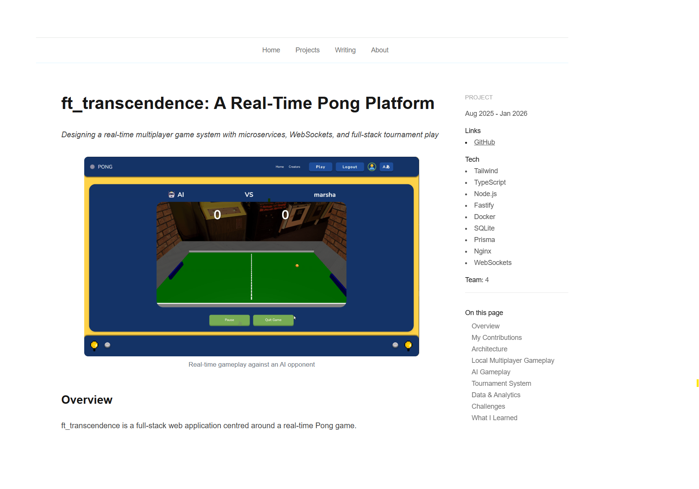

# Portfolio Website

Personal portfolio to showcase my projects and writing in data and software. 

Built as a content system where  projects and articles are written as structured markdown and rendered into pages automatically.

🔗 Live site: <a href="https://marshateo.com" target="_blank" rel="noopener noreferrer">
  https://marshateo.com
</a>

## Why I built this

  <picture>
    <source media="(prefers-color-scheme: dark)" srcset="./public/sunset-text.svg">
    
  </picture>

I wanted a portfolio that reflects how I think and learn. Instead of using a template, I built this from scratch to:
- Write and publish technical articles
- Present projects with context, not just screenshots
- Treat my learning as something worth documenting

## Features

- Markdown-powered content system for writing and projects
- Reusable content schema across writing and projects
- Table of contents with active section tracking using IntersectionObserver
- Static generation for fast performance

## Tech Stack

- Next.js (App Router)
- TypeScript
- Tailwind CSS
- Markdown pipeline (remark, rehype)
- Vercel (deployment)

## Architecture

Content is managed via a file-based system:
- `/content/writing` contains articles. 
	- E.g., [JavaScript Event Loop series](./content/writing/javascript-event-loop-landing.md)
- `/content/projects` contains project pages. 
	- E.g,, [ft_transcendence](./content/projects/transcendence.md)

Each file includes frontmatter metadata (title, date, tech, links) which drives page generation.

### Content pipeline

Custom utilities:
- `getAllContentMeta()` → builds listing pages  
- `getContentBySlug()` → renders individual pages  

Markdown is processed using:
- remark (parsing)  
- rehype (HTML transformation, syntax highlighting)  

This setup allows me to:
- Add new content without touching React components  
- Keep structure consistent across the site  
- Treat content as data, not hardcoded UI  

## What I learned

This project helped me think more clearly about:

- Structuring content systems instead of hardcoding UI
- The boundary between content and presentation
- How React + Next.js actually render pages 
- Designing for readability, not just aesthetics

## Future Improvements

- MDX support for interactive components in articles
- Dark mode
- Analytics to understand what people read

## More details

A full write-up of this project is available on the 
<a href="https://marshateo.com/projects/portfolio" target="_blank" rel="noopener noreferrer">
  site
</a>.